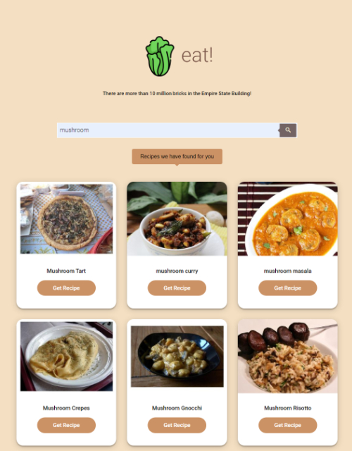
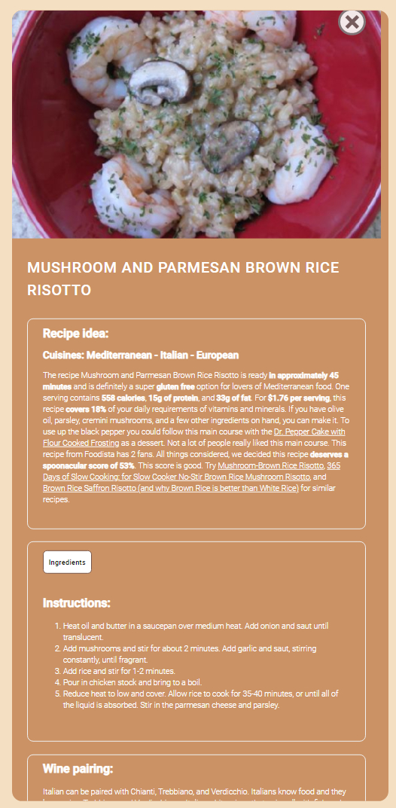
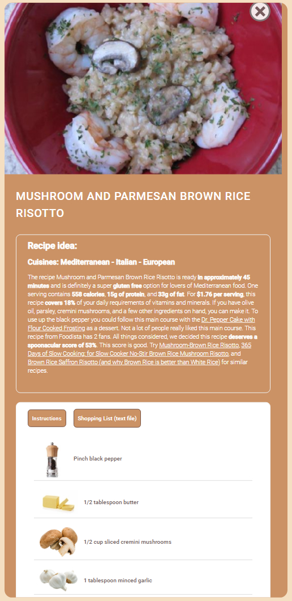
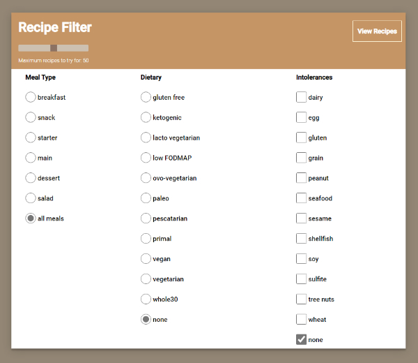

# USYD-FSF Week 7 Team Project
## Project 1: Recipe Generator

### Table of Contents  
  
   01. [Project Description](#1-description)
   02. [User Story](#2-user-story)
   03. [Acceptance Criteria](#3-acceptance-criteria)
   04. [Application Features](#4-features)
   05. [Installation](#5-installation)
   06. [Usage](#6-usage)
   07. [Credits](#7-credits)
   08. [License](#8-license)
   09. [Repository Status](#9-github-repo-status)
   10. [Contribute](#10-how-to-contribute)
   11. [Tests](#11-tests)
   12. [Checklist](#12-checklist)

---
### 1. Description  
**What is this project?**  
* A recipe generator using Spoonacular's API for the recipes and Uselessfacts API for streaming quotes. 

**Why this project?**  
* We were asked to create an application as part of a team to gain an understanding of coding team environments.  Specifically we were asked to conceive and execute a design that solves a real-world problem by integrating data received from multiple server-side API requests.  

* After some discussion on other apps we decided people are often wondering what to make and often have a key ingredient in mind.  This application responds to that need.

**What problem does this project solve?**  
* Provides a recipe generator that users key in the main ingredient and suggested recipes are generated for their selection.

**Lessons learnt?**  
* Git merge conflicts can be a nightmare to resolve.  A lot of time was lost resolving conflicts in our various merges.  Some key takeaways was:
   1.  Good API's with reasonable free access is really hard to find.  Also the quality of the data in the API's is out of your hands - for example when accessing their images or just the way information you are using has been added into their database.  
   2.  Don't make changes to files stored server side, that is on Github.  Causes conflicts that are really difficult to resolve and resulted with us having to revert to a previous day's merge and then rebuild from there.
   3.  Saving your local project to the desktop or somewhere else is a provides a safety gap if you are concerned with a merge causing conflicts in your code.
   4.  Regular catch ups / scrums help to keep the momentum in the production.
   5.  Waiting for your project team to approve a pull request to main can be a bit frustrating when you want to see your changes merged with what is in the main.
   6.  The Git environment is bureaucratic with the need to pull main into your branch when main is updated, in particular the process to do it.  Should be a simpler command to pull from main than having to go into main and run a push command.

---
### 2. User Story  

```
AS A busy person who loves to cook
I WANT to quickly be able to find recipes based on 1 key ingredient
SO THAT I can get inspiration for cooking a meal around the ingredient I feel like.
```
---
### 3. Acceptance Criteria  

```
GIVEN a search bar
WHEN I search for 1 ingredient
THEN I am presented with a filter to select my meal type, dietary and intolerance requirements
WHEN I finish selecting my filter requirements
THEN I am presented with up to 10 recipe suggestions
WHEN I select one of the recipes listed
THEN I am presented details on how to make the dish, including ingredients needed
WHEN I select to save the recipe
THEN I the recipe is kept in my local storage for access later
```
---
### 4. Features  
Client requested features as implemented:  
-  

#### The webpage

  
 

---
### 5. Installation  
You can download the source code from the team repository located in: [ Github](https://github.com/Mark33Mark/recipe-generator) and open the index.html file to review the website inside your selected web browser.  
Alternatively, the webpage has also been hosted via [URL: eat.watsonised.com](https://eat.watsonised.com)

---
### 6. Usage  
The code is available from the team's [Github repository](https://github.com/Mark33Mark/https://github.com/Mark33Mark/recipe-generator) and includes all assets required for the project.  
Once you've downloaded, you can modify the code as you need.

---
### 7. Credits  
Thanks again W3-schools.  Their responsive CSS framework is excellent and it was used extensively in the styling of the application.  
Thanks to Spoonacular for what is a great API with excellent documention.  Their free service is very limited with only 150 calls per day however their paid service is very expensive, the basic plan is US$29/month and only allows 1,500 calls per day then US$0.005 / call.  They do offer a university / hackathon subscription allowing 5,000 calls per day for US$10/month but you need a University email to confirm your student status.

---
### 8. License  
 The works in this repository are subject to:  

[](doc/license_MIT.md)

---
### 9. Github repo status  


---
### 10. How to Contribute
 If you would like to contribute, please comply with the Contributor Covenant Code of Conduct:  

[](doc/code_of_conduct.md)

---
### 11. Tests  
- Tested on both Apple OS and Microsoft Windows 10 Pro desktop computers, Samsung Note 10+ and laptop computers with both Apple and Microsoft operating systems. Also reviewed the app in the browser's developer tool's mobile phone emulator.  As far as we observed, the app is responsive and functioning well across all devices.

---
### 12. Checklist  
 All actions not checked are still to be completed:
  * [X]  Write your own user stories and acceptance criteria add it to GitHub Issues;
  * [x]  Uses at least 2 server-side API's, we selected Spoonacular and Uselessfacts API's;
  * [x]  Uses a CSS framework other than Bootstrap, specifically we used w3CSS;
  * [x]  Uses client-side storage to store persistent data, we store the filter preferences of the user;
  * [x]  A polished UI, we focused on a minimalist UI and we think we achieved it;
  * [x]  Meet good quality coding standards (indentation, scoping, naming, etc) - we used prettier for the indentation and followed best practice for the other items.
  * [x]  Must not use alerts, confirms or prompts.  We used innerHTML method to write to the webpage any issues.
  * [x]  Must be interactive, that is accepts and responds to user input.  We achieved this through event monitoring in the JavaScript.
  * [x]  Deployed at live URL, [lettuce eat website](https://eat.watsonised.com) 
  * [x]  Application loads with no errors when inspected with Chrome DevTools.
  * [x]  Github repository contains our application code [Github location](https://github.com/Mark33Mark/recipe-generator)
  * [x]  Repository has a unique name; follows best practice for file structure; and naming conventions.
  * [x]  Repository contains multiple descriptive commit messages.
  * [x]  Repository contains a README file with description, screenshot and link to deployed application.
---

- [Back to the top](#usyd-fsf-week-7-team-project)